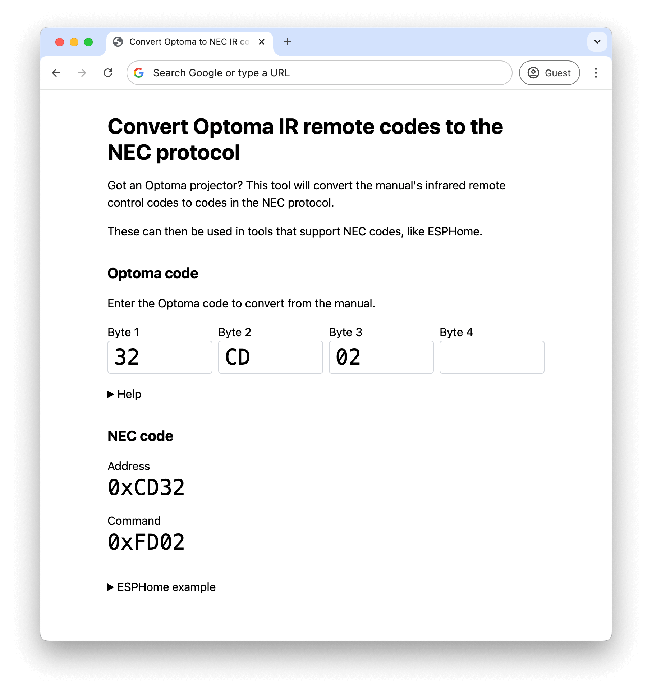

# optoma-ir-to-nec [(view live)](https://adamjones.me/optoma-ir-to-nec/)

A webapp to convert Optoma IR remote codes to the NEC protocol.

## Contributing

Pull requests are welcomed on GitHub! To get started:

1. Install Git and Node.js
2. Clone the repository
3. Install dependencies with `npm install`
4. Run `npm start` to start the app
5. Run `npm run test` to run tests
6. Build with `npm run build`
